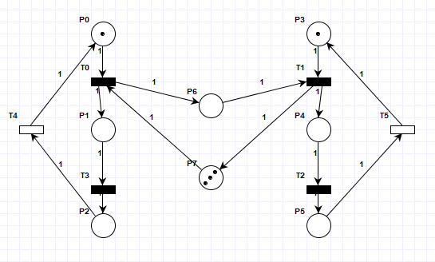
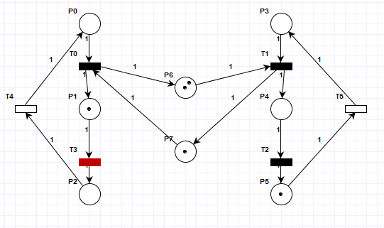
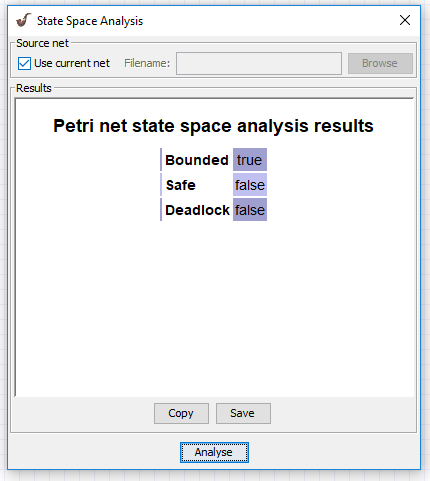
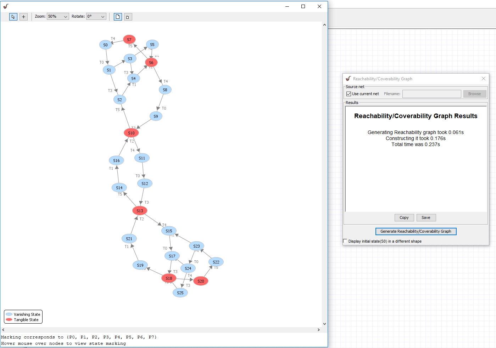
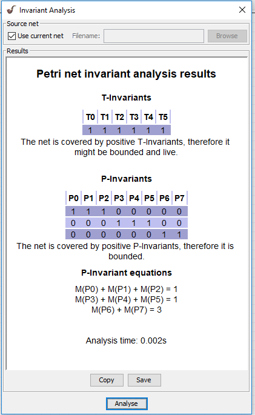

# Sprawozdanie z labów 10

Radomir Krawczykiewicz wtorek 9:35

## Przykład

### Tresc

## Zadanie 1

### Tresc

## Zadanie 2

### Tresc

licznik
3336 to inf w programie.

## Zadanie 3

### Tresc

Zasymulowac wzajemne wykluczanie dwoch procesow na wspolnym zasobie.
Dokonac analizy niezmiennikow miejsc oraz wyjasnic znaczenie rownan (P-invariant equations).
Ktore rownanie pokazuje dzialanie ochrony sekcji krytycznej ?

## Zadanie 4

### Tresc
Uruchomic problem producenta i konsumenta z ograniczonem buforem (mozna posluzyc sie przykladem, menu:file, examples).
Dokonac analizy niezmiennikow.
Czy siec jest zachowawcza ?
Ktore rownanie mowi nam o rozmiarze bufora ?

### Model

W zadaniu został użyty gotowy model przykłądów.
Mamy dwa procesy(jednego producenta i jednego konsumenta) oraz pusty bufor o rozmiarze 3.





### Analiza

Z analizy niezmienników widzimy że sieć jest ograniczona.
Jest to sięc zachowawcza ponieważ zmieniajać swój stan jesteśmy w stanie zawsze wrócic do tego samego stanu.
Równanie mówiące o rozmiarze bufora to :
```
M(P6) + M(P7) = 3
```







## Zadanie 5

### Tresc
Stworzyc symulacje problemu producenta i konsumenta z nieograniczonym buforem.
Dokonac analizy niezmiennikow.
Zaobserwowac brak pelnego pokrycia miejsc.

## Zadanie 6

### Tresc

Zasymulowac prosty przyklad ilustrujacy zakleszczenie.
Wygenerowac graf osiagalnosci i zaobserwowac znakowania, z ktoroch nie mozna wykonac przejsc.
Zaobserwowac wlasciwosci sieci w "State Space Analysis".
Ponizej przyklad sieci z mozliwoscia zakleszczenia (mozna wymyslic inny):
