# Sprawozdanie z labów 10

Radomir Krawczykiewicz wtorek 9:35

## Przykład

### Tresc

Prosty model maszyny stanów swiateł ulicznych przedstawia sieć na rysunku poniżej.
Stanami sa miejsca sieci, zaś znacznik pokazuje w jakim stanie aktualnie sie znajdujemy.

### Model

Model jak w treści zadania


### Analiza

Zadanie omówione na zajeciach.

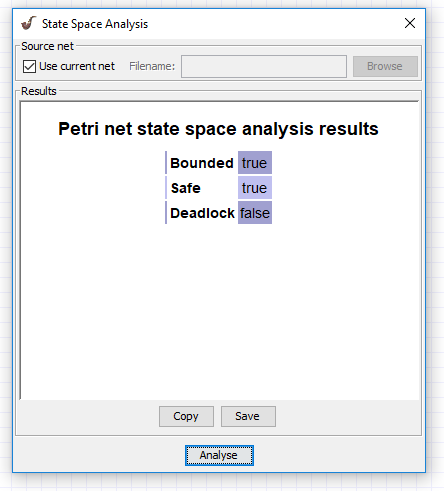


## Zadanie 1

### Tresc

Wymyslic wlasna maszyne stanow, zasymulowac przyklad i dokonac analizy grafu osiagalnosci oraz niezmiennikow j.w.

### Model

Model przedstawia działanie funkcji fork.

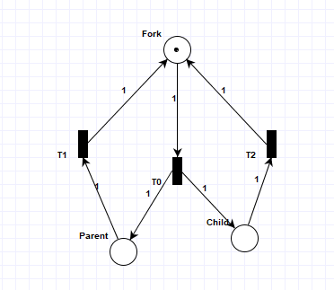

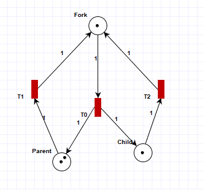

### Analiza

Zadanie omówione na zajeciach.

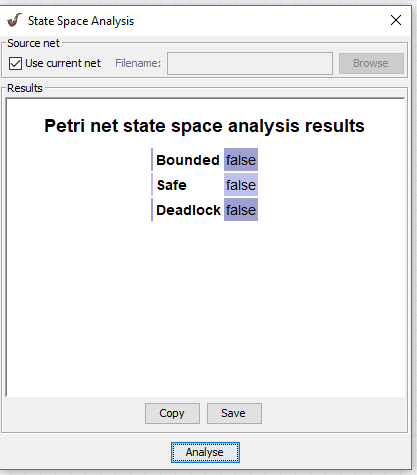

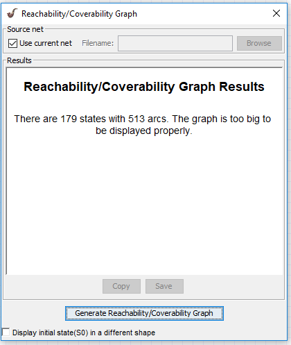

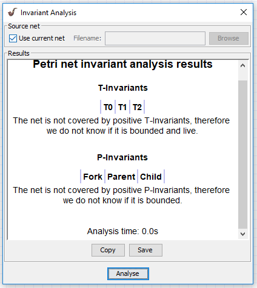

## Zadanie 2

### Tresc

Zasymulowac siec jak ponizej. Dokonac analizy niezmiennikow przejsc.
Jaki wniosek mozna wyciagnac o odwracalnosci sieci ?
Wygenerowac graf osiagalnosci.
Prosze wywnioskowac z grafu, czy siec jest zywa.
Prosze wywnioskowac czy jest ograniczona. Objasnic wniosek.

### Model

Model przedstawia działanie licznika liczącego do inf.

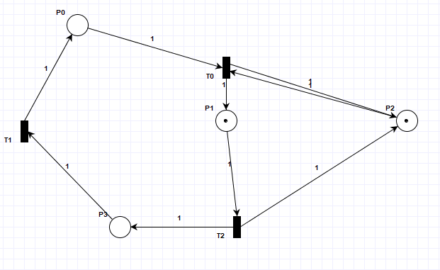

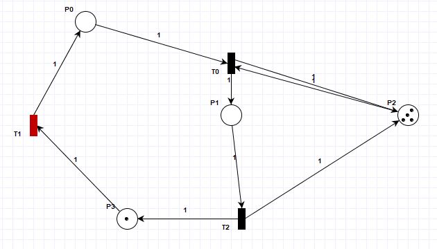

### Analiza

Zadanie omówione na zajeciach.
3336 to inf w programie.

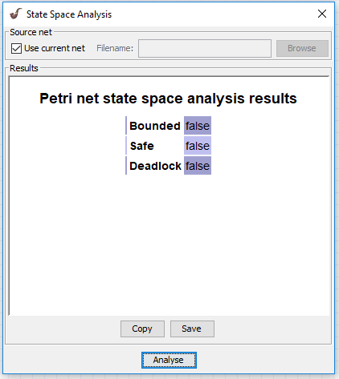

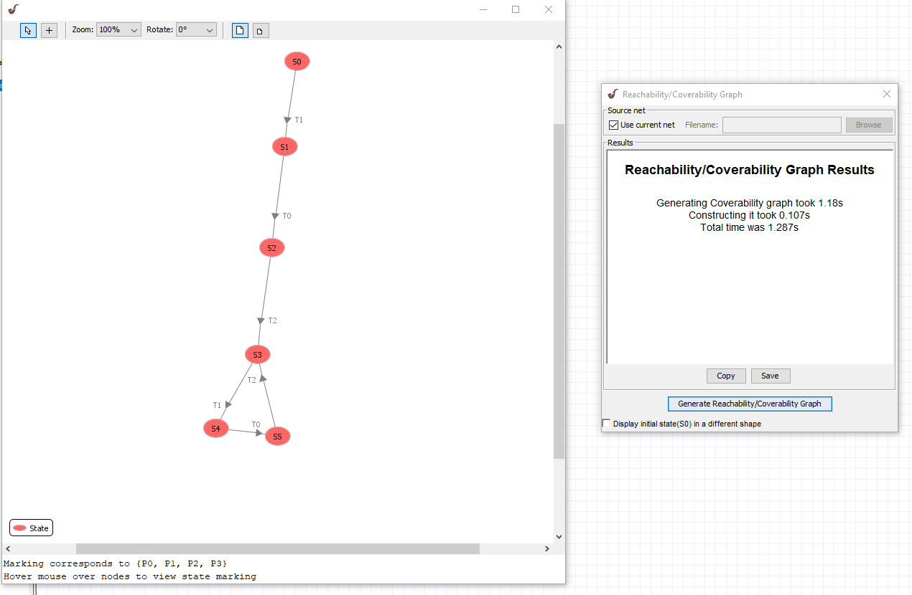

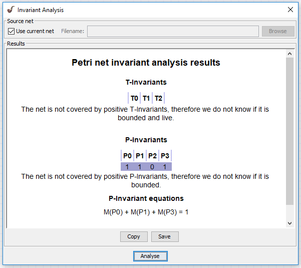

## Zadanie 3

### Tresc

Zasymulowac wzajemne wykluczanie dwoch procesow na wspolnym zasobie.
Dokonac analizy niezmiennikow miejsc oraz wyjasnic znaczenie rownan (P-invariant equations).
Ktore rownanie pokazuje dzialanie ochrony sekcji krytycznej?

### Model

Model przedstawia działanie dwóch procesów które pobierają zasób, wykonują akcje i oddają zasób.
Zasób może mieć tylko jeden proces naraz.

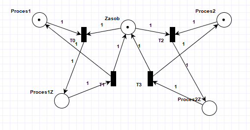

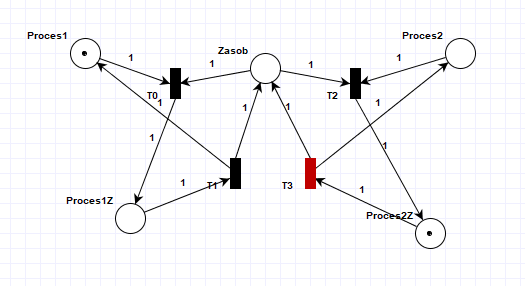

### Analiza

Z analizy State Space widzimy że sięc nie ma deadlocków oraz jest ograniczonona i bezpieczna.
Wynika to z faktu że kiedy proces pobierze zasób kolejna akcją jaką zrobi jest jego oddanie.
Reachability/Coverability Graph pokazuję że sięć ma tylko 3 stany(któryś z procesów ma zasób albo żaden).
Pierwsze dwa równania P-invariant mówia nam że procesy mają swóje osobne cykle stanów.
Ostatnie równanie mówi nam że zasób może być tylko u jednego procesu naraz albo być wolny.

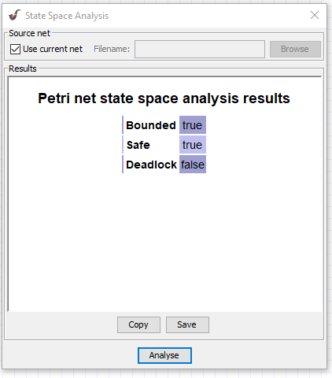

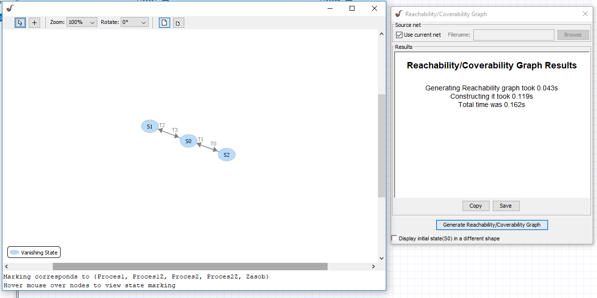

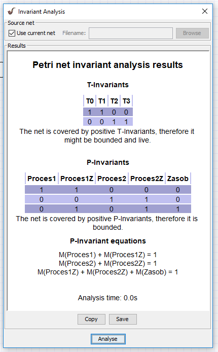

## Zadanie 4

### Tresc

Uruchomic problem producenta i konsumenta z ograniczonem buforem (mozna posluzyc sie przykladem, menu:file, examples).
Dokonac analizy niezmiennikow.
Czy siec jest zachowawcza ?
Ktore rownanie mowi nam o rozmiarze bufora ?

### Model

W zadaniu został użyty gotowy model przykłądów.
Mamy dwa procesy(jednego producenta i jednego konsumenta) oraz pusty bufor o rozmiarze 3.


### Analiza

Z analizy niezmienników widzimy że sieć jest ograniczona, ponieważ nie rosnie nam ilośc tokenów.
Jest to sięc zachowawcza ponieważ zmieniajać swój stan jesteśmy w stanie zawsze wrócic do tego samego stanu.
Równanie mówiące o rozmiarze bufora to :
```
M(P6) + M(P7) = 3
```


## Zadanie 5

### Tresc

Stworzyc symulacje problemu producenta i konsumenta z nieograniczonym buforem.
Dokonac analizy niezmiennikow.
Zaobserwowac brak pelnego pokrycia miejsc.

### Model

Model jest uproszceniem modelu z poprzedniego zadania, po przez usunięcie rozmiaru bufora.

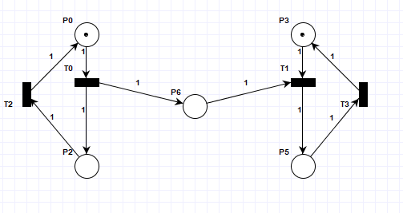

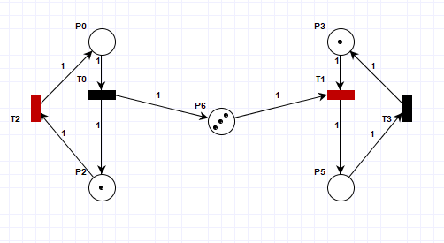

### Analiza

Z analizy niezmieników widzimy że sięć może być zarówno ograniczona jak i nie.
Sięc jest jednak zachowawcza.
State Space Analysis informuje nas że sięc nie ma deadlocków ale jest potencjanie nie ograniczona.
Wynika to z faktu że producent może tworzyć szybciej niż konsument pobierać.
Sytuacja jest mocno losowa i zmiena bo zależy od tego jaka bedzie kolejność działania(może działąć np tylko producent).
Tym samym Reachability/Coverability Graph nie jest w stanie wygenerować grafu.

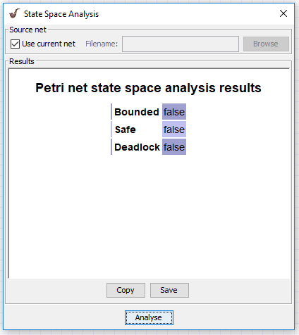

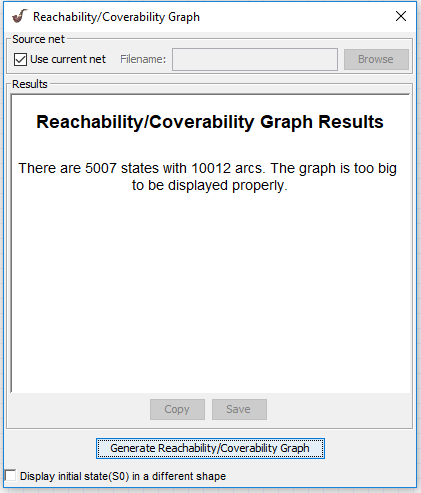

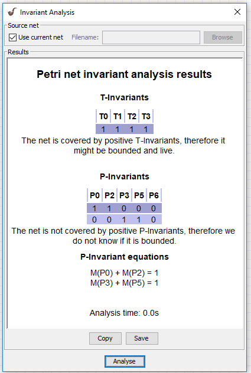

## Zadanie 6

### Tresc

Zasymulowac prosty przyklad ilustrujacy zakleszczenie.
Wygenerowac graf osiagalnosci i zaobserwowac znakowania, z ktoroch nie mozna wykonac przejsc.
Zaobserwowac wlasciwosci sieci w "State Space Analysis".
Ponizej przyklad sieci z mozliwoscia zakleszczenia (mozna wymyslic inny):

### Model

Został użyty model z treści zadania.
Symuluję on sytuacje gdzie każdy proces może wykonać dwie akcje A lub B.
Jednak aby ich akcja się powiodła oba muszą wybrać tą samą akcje.

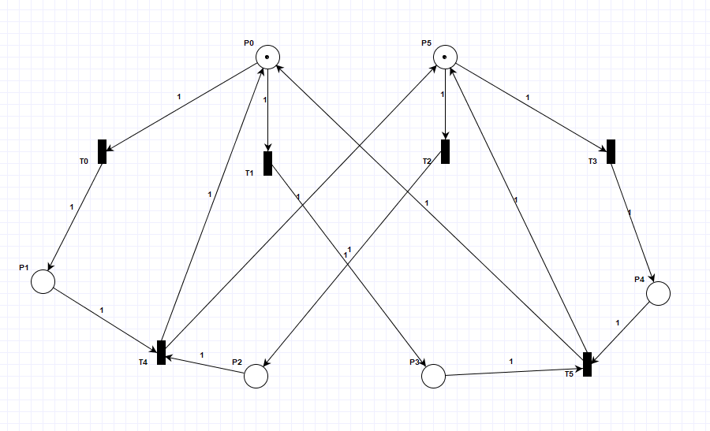

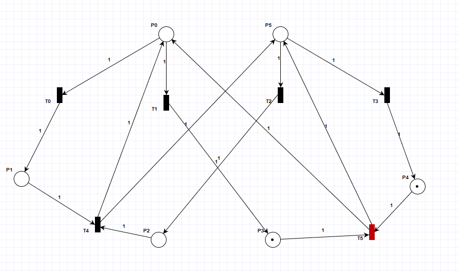

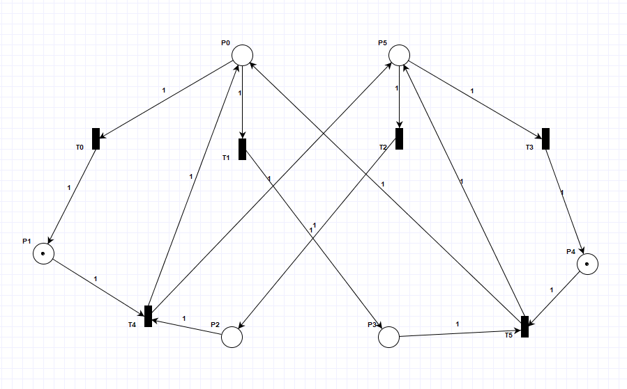

### Analiza

State Space Analysis potwierdza nasze przypuszcenia o zakleszczeniu.
Podaje on też jedna z najkrótszych scieżek. Czyli jedne proces wybiera opcje A a drugi B.
Jest to sieć ograniczona ponieważ nie są tworzone dodatkowe tokeny.
Na Reachability/Coverability Graph widzimy że stanami zakleszczenia są takie stany z których nie ma wychodzących strzałek(S6 i S7).

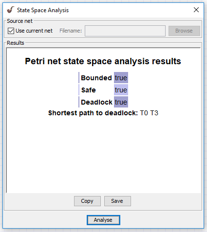

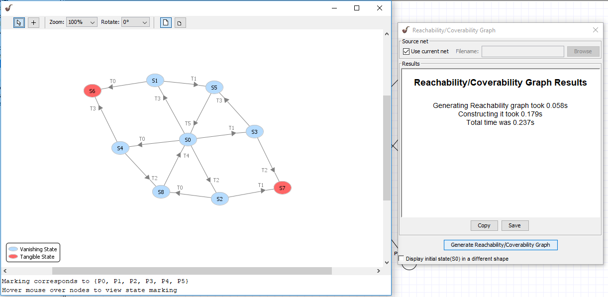

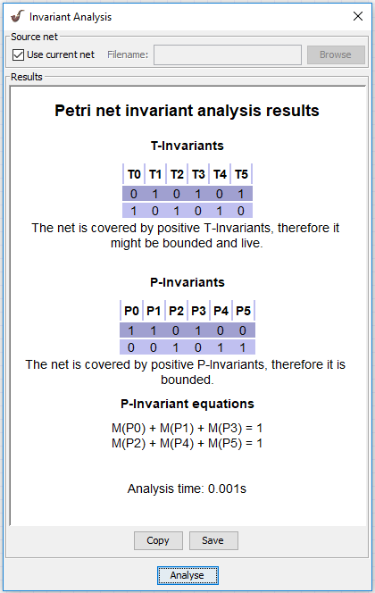
